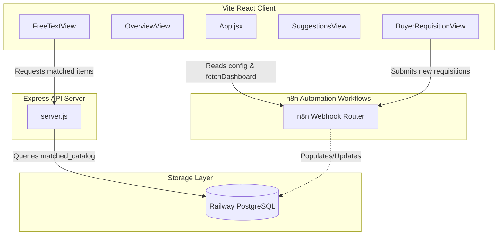

# Free Text Requisitions AI Matching — Technical Documentation

This project is an intelligent procurement assistant that automatically matches free-text employee purchase requests with approved catalog items or suppliers based on historical purchases and catalog data. If no match exists, it identifies high-frequency or high-value items to suggest contract negotiations.

---

## 1. System Architecture

The application is structured as a decoupled client-server architecture with an external automation pipeline:



### Components

1.  **Frontend (React + Vite):** A modern SPA dashboard styled with vanilla CSS. It uses **Recharts** for analytics and **Lucide React** for iconography. It operates on a tab-based view switching between overview metrics, live matched tables, suggestions, and the requisition form.
2.  **Backend (Node.js + Express):** A lightweight API server responsible for querying the database and exposing clean JSON endpoints to the frontend.
3.  **Database (PostgreSQL on Railway):** Hosts the transactional and AI-processed results in the `matched_catalog` table.
4.  **Automation (n8n Integration):** Runs external workflow logic, processes free-text orders with LLM agents, performs matching confidence math, and populates the database.

---

## 2. Directory Structure

Below is an overview of the key folders and files in the repository:

```
├── .env                  # Environment configurations (DB & n8n base url)
├── inspect-db.mjs        # Script to inspect the Railway DB structure
├── package.json          # Node dependencies and scripts
├── server.js             # Express backend API server
├── src/
│   ├── App.jsx           # Main client coordinator (tab state & API sync)
│   ├── App.css           # Core styling for layouts and generic elements
│   ├── index.css         # Entry style rules
│   ├── components/
│   │   ├── ProcurementView.jsx   # Celonis-style view (Alternative / Reference UI)
│   │   ├── ProcurementView.css
│   │   └── views/
│   │       ├── OverviewView.jsx  # Main KPI charts & Recharts visuals
│   │       ├── FreeTextView.jsx  # DB Table for matched items with confidence scores
│   │       ├── SuggestionsView.jsx # Contract suggestion cards & analytics
│   │       └── BuyerRequisitionView.jsx # Plain text form for submitting purchase requests
│   └── lib/
│       ├── api.js        # API request functions (n8n & local Express routes)
│       ├── colors.js     # Shared design system color variables
│       └── utils.js      # Utility helpers
```

---

## 3. Database Schema

The database table `matched_catalog` contains AI-matched and classified requisition records.

### Columns and Data Types

| Column Name | Data Type | Description |
| :--- | :--- | :--- |
| `id` | `INTEGER` (PK) | Auto-incrementing identifier |
| `draft_id` | `VARCHAR` | Temporary transaction identifier for drafts (e.g. `DRAFT-1781242368963`) |
| `material_id` | `VARCHAR` | Reference code for matched catalog materials (e.g. `MAT-CH-001`) |
| `description` | `TEXT` | Raw user input or item description (e.g. `IPA ULSI 185L Drum`) |
| `supplier` | `VARCHAR` | Supplier associated with the transaction (e.g. `Honeywell Specialty Chemicals`) |
| `cost` | `DECIMAL` | Requisition item cost in EUR |
| `delivery_date` | `TIMESTAMP` | Expected delivery date |
| `status` | `VARCHAR` | Requisition state: `pending`, `approved`, `rejected` |
| `priority` | `VARCHAR` | Importance status: `high`, `medium`, `low` |
| `match_pct` | `INTEGER` | Integer representation of confidence (e.g. `98`) |
| `is_matched` | `BOOLEAN` | Boolean flag indicating whether the item was successfully matched to a catalog material |
| `match_type` | `VARCHAR` | Categorization type: `catalogue` |
| `category` | `VARCHAR` | Material procurement category (e.g., `Chemicals & Gases`) |
| `confidence_score`| `DECIMAL` | Normalized AI confidence coefficient between `0.00` and `1.00` |
| `decided_at` | `TIMESTAMP` | Record timestamp of when the buyer decision was made (null if pending) |
| `created_at` | `TIMESTAMP` | Creation date of the transaction |

> [!NOTE]
> Run the inspection script locally to verify schema and database connectivity:
> ```bash
> node inspect-db.mjs
> ```

---

## 4. Frontend View Breakdown

### `OverviewView.jsx`
*   **KPI Indicators:** Total requisitions, pending approvals, average match confidence, total line items, free-text rate, and category counts.
*   **Charts:**
    *   *Orders by Material Category:* Horizontal stacked Recharts bar chart showing catalog-linked versus free-text share.
    *   *Catalog Coverage:* Circular donut chart indicating the percentage distribution of linked versus free-text orders.
    *   *Development over Time:* Stacked bar & line combination chart detailing historical trends.
    *   *Free-Text Orders by Plant:* Donut chart showcasing division of requests across imec administrative locations and plants.

### `FreeTextView.jsx`
*   **Purpose:** Live visualization of all items processed and matching catalog resources.
*   **Integration:** Calls `fetchMatchedCatalogue()` which retrieves records from the local Express API.
*   **Features:** Search filter by description/material code, tab-based status filtering (`All`, `Pending`, `Approved`, `Rejected`), and color-coded confidence indicators based on `match_pct`.
*   **Fallback:** If the backend is unreachable or contains no rows, the view falls back gracefully to local demo data `DEMO_orders`.

### `SuggestionsView.jsx`
*   **Purpose:** Highlights high-value, recurring items ordered as free-text to suggest bulk-contracts.
*   **Features:**
    *   *Calling Cards:* Focuses on high-priority alerts representing significant potential annual savings.
    *   *Analytics Grid:* Demonstrates total potential savings based on contract creation rules (e.g., 5% to 12% discount rates).
    *   *Action Triggers:* Simulates the generation of framework contracts or catalog additions.

### `BuyerRequisitionView.jsx`
*   **Purpose:** Replaces complex procurement request forms with a clean interface.
*   **Fields:** Description (text area), Buyer Name, Buyer Email, and Plant/Location dropdown.
*   **Payload structure sent to n8n intake:**
    ```json
    {
      "description": "Plain language description of requested goods...",
      "raw_body": "Plain language description...",
      "buyer_name": "Buyer Name",
      "sender": "Buyer Name",
      "email": "buyer.email@example.com",
      "requester_email": "buyer.email@example.com",
      "client_name": "Plant Selection",
      "plant": "Plant Selection"
    }
    ```

---

## 5. API Surface Configuration

The connection endpoints are managed in [src/lib/api.js](file:///e:/imec-latest/Free_Text_Requisitions/src/lib/api.js):

### Backend Express Route
*   `GET /api/matched-catalogue`: Fetches database records from Railway.

### n8n Integrations
*   `GET /webhook/api/dashboard`: Fetches global statistical metrics to inject into views.
*   `POST /webhook/buyer-requisition`: Receives new requisition submissions.
*   `POST /webhook/buyer-decision`: Endpoint structure to send buyer approvals/rejections of suggestions back to the automation loop.

---

## 6. Setup & Execution

### Prerequisites

Create a `.env` file in the project root containing your database credentials and the base URL of your n8n workflows:

```env
DATABASE_URL=postgresql://<user>:<password>@<host>:<port>/<database>
VITE_N8N_BASE_URL=https://n8n.sofiatechnology.ai
API_PORT=3001
```

### Script Execution Commands

| Command | Action Description |
| :--- | :--- |
| `npm run dev:all` | **Recommended:** Starts both the Vite Frontend Dev Server and Express Backend API Server concurrently. |
| `npm run dev:server`| Launches only the Express backend server on port `3001`. |
| `npm run dev` | Runs only the frontend dev server (Vite) on port `5173`. |
| `npm run build` | Compiles client assets into static files inside the `dist` directory. |
| `npm run lint` | Evaluates Javascript quality using ESLint. |

> [!WARNING]
> If the n8n base URL is configured incorrectly or workflows are paused, the dashboard will fall back to using static mock data to keep the interface interactive. Check the terminal outputs for connection logs.

